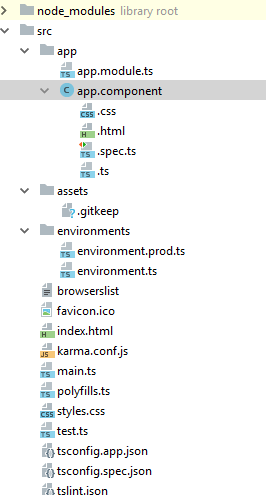

Hướng dẫn cài đặt angular
=======================

# I. Cài đặt các công cụ
  
  - Chúng ta cần phải cài đặt NodeJS

  - Sau đó sử dụng lệnh npm install @angular/cli -g để cài đặt angular cli

# II. Tạo mới project
  
  - Tạo với lệnh `ng new <myapp>`

  - Sau đó dùng lệnh `ng serve` để tiến hành build và chạy ứng dụng web (mặc định port 4200)

# III. Thành quả

   > 

   - Trong đó app.component là component root trong đây bao gồm:
     
      + html: Nơi chứa html

      + css: định dạng css

      + spec.ts : Unit test
    
    - Moduld root sẽ được khởi chạy đầu tiên trong project

