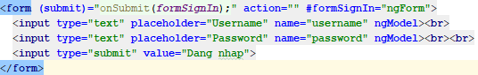
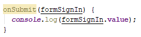
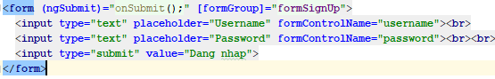
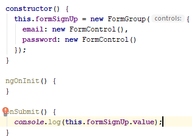
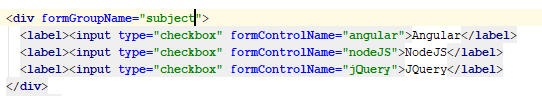
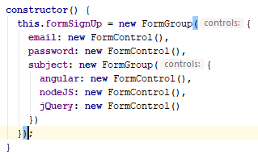

Hướng dẫn sử dụng ngForm trong angular
============================

# I. Cài đặt code

  > 

  - Trong đó:
    
    + `(submit)` là sự kiện được bắt khi submit form. Trong hàm được chạy khi submit có tham số truyền vào
    
    là formSignIn được gán là ngForm

    + `ngModel` được gán cho tất cả input

  > 

  - Trong đó: `onSubmit` : được thực hiện tại `.ts`

  - Khi chúng ta nhấn submit thì sẽ log ra 1 object có dạng `{username: "z", password: "vvv"}`

  - Nếu chung ta ném ra 1 ngoại lệ trong onSubmit thì trang sẽ được load lại. Vì vậy chúng ta chỉ cần sử dụng `ngSubmit` thay cho `(submit)`

# II. Thực hiện validate form đơn giản

  - Thêm `require` cho mỗi thẻ input để yêu cầu là trường đó phải đươc nhập

  - Sau đó tạo 1 thẻ `
` ở dưới thẻ username với `*ngIf` là
   `formSignIn.controls.username?.errors?.required`

   - Khi đó nếu dữ liệu của ô username bị rổng thì thẻ p sẽ hiện lên

Reactive form
=================================

# I. Cài đặt code

  - Chúng ta sẽ tạo 1 component mới và sử dụng template như sau:
    
    > 

  - Chúng ta sẽ phải import thêm ReactiveFormModules vào trong app module

    >  

  - Tại .ts chúng ta sẽ xử lý như trên để tiến hành cài đặt sự kiện onSubmit

# II. Thêm 3 checkbox cho form để tiến hành gom nhóm các checkbox lại

   >  

  - Chúng ta sẽ thêm vào 1 các checkbox và nhóm chúng vào 1 group và đặt tên cho group đó

   > 

  - Chúng ta sẽ thay đổi như trên để thêm các formControl

   