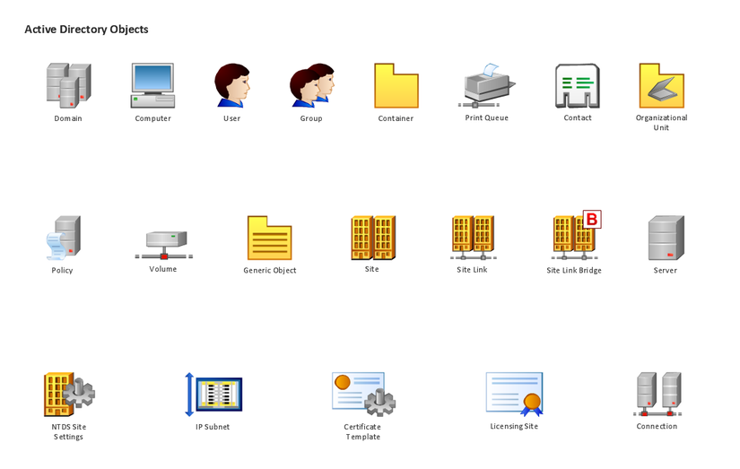
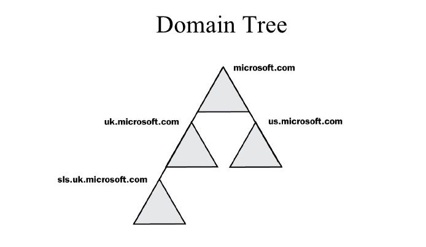

Tổng quan
============================================

# I. Active Directory là gì ?

   > 
   
   - Active Directory (AD) là một kiến trúc độc quyền của Microsoft. Đây là một kiến trúc không thể thiếu được trên Windows Server, được hiểu nôm na là một dịch vụ thư mục. 
   
   - Active Directory là một hệ thống được chuẩn hóa với khả năng quản trị tập trung hoàn hảo về người dùng cũng như các nguồn tài nguyên trong một hệ thống mạng. 
   
   - Active Directory được sử dụng trong mô hình mạng “Server - Client”.

   - Active Directory dùng để lưu trữ dữ liệu của domain như các đối tượng user, computer, group cung cấp những dịch vụ (directory services) tìm kiếm, kiểm soát truy cập, ủy quyền, 
   
   - Active Directory có dịch vụ chứng thực được xây dựng dựa trên giao thức Keberos hỗ trợ cơ chế single sign-on, cho phép các user chỉ cần chứng thực một lần duy nhất khi đăng nhập vào domain 
   và có thể truy cập tất cả những tài nguyên và dịch vụ chia sẻ của hệ thống với những quyền hạn hợp lệ

   - Active Directory đã làm giảm nhẹ công việc quản lý và nâng cao hiệu quả hoạt động, những công việc mà hầu như không thể thực hiện được trên một hệ thống mạng ngang hàng, 
   phân tán thì giờ đây chúng ta có thể tiến hành một cách dễ dàng thông qua mô hình quản lý tập trung như đưa ra các chính sách chung cho toàn bộ hệ thống nhưng đồng thời 
   có thể ủy quyền quản trị để phân chia khả năng quản lý trong một môi trường rộng lớn.

# II. Những tính năng của Active Directory

   - `Centralized Data Store` - Lưu trữ dữ liệu tập trung: 
      
       + Toàn bộ dữ liệu, thông tin trong hệ thống được lưu trữ một cách tập trung, cho phép người dùng có thể truy cập dữ liệu từ bất cứ nơi đâu, bất cứ lúc nào 
       
       + Nâng cao hiệu năng quản trị của hệ thống, giảm thiếu độ rủi ro cho tài nguyên.

   - `Scalability` - Khả năng linh hoạt với nhu cầu: 
      
        + Active Directory cung ứng một cách linh hoạt các giải pháp quản trị khác nhau cho từng nhu cầu cụ thế trên nền tảng hạ tầng xác định của các doanh nghiệp.
        
   - `Extensibility`:
        
        + Cơ sở dữ liệu của Active Directory cho phép nhà quản trị có thể customize và phát triển
        
        + Ta còn có thể phát triển các ứng dụng sử dụng cơ sở dữ liệu này, giúp tận dụng hết khả năng, hiệu năng của Active Directory.
        
   - `Manageability` - Khả năng quản trị linh hoạt dễ dàng: 
   
        + Active Directory được tổ chức theo cơ chế của Directory Service dưới mô hình tổ chức Directory giúp các nhà quản trị có cái nhìn tổng quan nhất đối với cả hệ thống 
        
        + Giúp user có thể dễ dàng truy xuất và sử dụng tài nguyên hệ thống.   
        
   - `Integration` with `Domain Name System` (DNS): 
        
        + DNS là một partner rất cần thiết đối với Active Directory, trong một hệ thống mạng, các dịch vụ của Active Directory chỉ hoạt động được khi dịch vụ DNS được cài đặt. 
        
        + DNS có trách nhiệm dẫn đường, phân giải các Active Directory Domain Controller trong hệ thống mạng, và càng quan trọng hơn trong môi trường Multi Domain. 
         
        + DNS được dễ dàng tích hợp vào Active Directory để nâng cao độ bảo mật và khả năng đồng bộ hóa giữa các Domain Controller với nhau trong môi trường nhiều Domain.     
   
   - `Client Configuration Management`: 
   
        + Active Directory cung cấp cho chúng ta một khả năng quản trị các cấu hình phía client, giúp quản trị hệ thống dễ dàng hơn và nâng cao khả năng di động của user.
        
   - `Policy - based administration`: 
        
        + Trong Active Directory, việc quản trị hệ thống mạng được đảm bảo một cách chắn chắc thông qua các chính sách quản trị tài nguyên, các quyền truy xuất trên các site, domain và các organization unit. 
        
        + Đây là một trong những tính năng quan trọng nhất được tích hợp vào Active Directory.
        
   - `Replication of information`: 
   
        + Active Directory cung cấp khả năng đồng bộ dữ liệu thông tin giữa các domain, trên nền tảng, môi trường nhiều domain nhằm mục đích giảm thiếu đến mức tối đa rủi ro và nâng cao khả năng họat động của hệ thống mạng.
        
   - `Flexible, secure authentication and authorization`: 
   
        + Active Directory cung cấp nhiều cơ chế authentication như Kerberos, Secure Socket Layer và Transport Layer Security giúp cho việc bảo mật thông tin của user khi xác thực thông tin truy xuất tài nguyên.
        
   - `Security integration`: 
   
        + Active Directory được tích hợp mặc định trong các phiên bản `Windows Server`, do đó Active Directory làm việc rất dễ dàng và linh hoạt, truy xuất điều khiển trên hệ thống được định nghĩa trên từng đối tượng, từng thuộc tính của đối tượng. 
        
        + Các chính sách bảo mật được áp dụng không phải đơn thuần trên local mà còn được áp dụng trên các site, `domain` hay `OU` xác định.
        
   - `Directory - enable applications and infrastructure`: 
   
        + Active Directory là một môi trường tuyệt hảo cho các nhà quản trị thiết lập các cấu hình và quản trị các ứng dụng trên hệ thống. 
        
        + Active Directory cung cấp một hướng mở cho các nhà phát triển ứng dụng (developer) xây dựng các ứng dụng trên nền tảng Active Directory thông qua Active Directory Service Interfaces.
        
   - `Interoperability with other directory services`: 
   
        + Active Directory được xây dựng trên giao thức directory service chuẩn gồm 2 giao thức là Lightweight Directory Access Protocol (LDAP) và Name Service Provider Interface (NSPI), 
        do đó Active Directory có khả năng tương thích với các dịch vụ khác được xây dựng trên nền tảng directory service thông qua các giao thức này. 
        Vì LDAP là một giao thức directoy chuẩn, do đó ta có thể phát triển, tích hợp các sản phẩm ứng dụng trao đổi, chia sẻ thông tin với Active Directory thông qua giao thức LDAP. 
        Còn giao thức NSPI được hỗ trợ bởi Active Directory nằm mục đích đảm bảo và nâng cao khả năng tương thích với directoy của Exchange.
   
   - `Signed and encrypted LDAP traffic`: 
   
        + Mặc định là công cụ Active Directoy trong windows server sẽ tự động xác thực và mã hóa thông tin, dữ liệu truyền tải trên giao thức LDAP. 
        
        + Việc xác thực giao thức nhằm đảm bảo thông tin được gửi đến từ 1 nguồn chính thức và không bị giả mạo.
   
   
KIến trúc của Active Directory
============================================

# I. Active Directory Objects:

   >  
    
   - Dữ liệu trong `Active Directory` như là thông tin `users`, `máy in`, `server`, `database`, `groups`, `computers` và `security policies` được tổ chức như các objects (đối tượng). 
   Mỗi object có những thuộc tính riêng đặc trưng cho object đó, ví dụ như object user có các thuộc tính liên quan như First Name, Last Name, Logon Name, … và Computer Object có các thuộc tính như computer name cùng description.

   - Một số object đặc biệt bao gồm nhiều object khác bên trong được gọi là các `container`, ví dụ như domain là một container bao gồm nhiều `user` và `computer account`.
   
# II.  Active Directory Schema:

   - Trong `Active Directory`, database lưu trữ chính là `AD Schema`, `Schema` định nghĩa các đối tượng được lưu trữ trong `Active Directory`. 
   Nhưng Schema lưu trữ các đối tượng thế nào? Thực chất, schema là một danh sách các định nghĩa xác định các loại đối tượng và các loại thông tin về đối tượng lưu trữ trong Active Directory. 
   Về bản chất, schema cũng được lưu trữ như 1 `object`.
   
   - Schema được định nghĩa gồm 2 loại đối tượng (object) là: `Schema Class objects` và `Schema Attribute objects`. 
   
       +  `Schema Class`: Có chức năng như một template cho việc tạo mới các đối tượng trong AD.  Mỗi Schema Class là một tập hợp các thuộc tính của đối tượng(`Schema Attribute Objects`). Khi bạn tạo một đối 
       tượng thuộc về một loại Schema Class thì Schema Attribute sẽ lưu trữ các thuộc tính của đối tượng đó tương ứng với loại Schema Class của đối tượng. 
       
       + `Schema Attribute`: Định nghĩa các `Schema Class` tương ứng với nó. Mỗi thuộc tính chỉ được định nghĩa một lần trong Active Directory và có thể thuộc  nhiều `Schema Class` theo quan hệ một nhiều (1-m).
   
   - Mặc định thì một tập hợp các `Schema Class` và `Schema Attribute` được đóng gói sẵn chung với `Active Directory`. Tuy nhiên `Schema` của `Active Directory` mở ra một khả năng 
   phát triển mở rộng `Schema Class` trên các `Attribute` có sẵn hay là tạo mới các `Attribute Schema`. Tuy nhiên cái nào cũng có cái lợi và cái hại, để có thể mở rộng phát triển 
   với schema, bạn cần chuẩn bị kỹ lưỡng thông qua các bản thiết kế rõ ràng và xem xét là có cần thiết hay không, vì độ rủi ro trong việc này khá cao đối với các hệ thống 
   đang hoạt động ổn định.
   
# III. Active Directory Components:

   - Trong mô hình mạng doanh nghiệp, các components của Active Directory được sử dụng, áp dụng để xây dựng nên các mô hình phù hợp với nhu cầu các doanh nghiệp. 
   Xét về khía cạnh mô hình kiến trúc của AD thì ta phân làm 2 loại là Physical và Logical.
   
### 1. Logical Structure:
      
   - Trong AD, việc tổ chức tài nguyên theo cơ chế Logical Structure, được ánh xạ thông qua mô hình domains, OUs, trees và forest. Nhóm các tài nguyên được tổ chức một cách luận lí cho phép bạn dễ dàng truy xuất đến tài nguyên hơn 
   là phải nhớ cụ thể vị trí vật lí của nó.
   
      + `Domain`: Cốt lõi của kiến trúc tổ chức luận lí trong AD chính là Domain, nơi lưu trữ hàng triệu đối tượng (objects). Tất cả các đối tượng trong hệ thống mạng trong 
      một domain thì do chính domain đó lưu trữ thông tin của các đối tượng. Active Directory được kiến tạo bởi một hay nhiều domain và một domain có thể triển khai trên 
      nhiều `physical structure`. Việc access vào domain được quản trị thông qua `Access Control Lists (ACLs)`, quyền truy xuất trên domain tương ứng với từng đối tượng.
      
       > 
      
      + `OUs`: `OU` là một container được dùng để tổ chức các đối tượng trong một domain thành các nhóm quản trị luận lí (`logical`). OUs cung cấp phương tiện thực hiện các tác vụ 
      quản trị trong hệ thống như là quản trị user và resources, đó là những `scope` đối tượng nhỏ nhất mà bạn có thể ủy quyền xác thực quản trị. `OUs` bao gồm nhiều đối tượng 
      khác như là user `accounts`, `groups`, `computers` và các OUs khác tạo nên các cây OUs trong cùng một domain. Các cây OUs trong một domain độc lập với kiến trúc các cây OUs 
      thuộc các domain khác.
       
        > 
      
      + `Trees`: `Trees` là một nhóm các domain được tổ chức theo cấu trúc hình cây với mô hình `parent-child` ánh xạ từ thực tế tổ chức của doanh nghiệp, tổ chức. 
      Một domain có 1 họăc nhiều child domain nhưng 1 child domain chỉ có 1 parent-domain mà thôi. Ví dụ: Trong domain framgia.com, có các domain thấp hơn 
      là abc.framgia.com và xyz.framgia.com thì được hiểu là Tree.  
      
         > 
        
      + `Forests`: `Forest` là một thuật ngữ được đặt ra nhằm định nghĩa 1 mô hình tổ chức của AD, 1 forest gồm nhiều domain trees có quan hệ với nhau, 
      các domain trees trong forest là độc lập với nhau về tổ chức, nghe ra có vẻ mâu thuẫn trong mối quan hệ nhưng ta sẽ dễ hiểu hơn khi mối quan hệ giữa các domain trees là 
      quan hệ `Trust 2 chiều` như các partners với nhau. Một forest phải đảm bảo thoả các đặc tính sau: 
         
         - Toàn bộ domain trong forest phải có 1 schema chia sẻ chung. – Các domain trong forest phải có 1 global catalog chia sẻ chung. 
         
         – Các domain trong forest phải có mối quan hệ trust 2 chiều với nhau. – Các tree trong 1 forest phải có cấu trúc tên(domain name) khác nhau. 
         
         – Các domain trong forest hoạt động độc lập với nhau, tuy nhiên hoạt động của forest là hoạt động của toàn bộ hệ thống tổ chức doanh nghiệp.
         
           > 
   
### 2. Physical Structure
  
   - Xét về khía cạnh physical component của AD sẽ gồm 2 phần là Sites và Domain Controllers. Tùy thuộc vào mô hình tổ chức của công ty, người quản trị sẽ phải dùng các components này để thiết kế sao cho phù hợp
  
     + Sites:
       
        - Site là một thuật ngữ được dùng đến khi nói về vị trí địa lý của các domain trong hệ thống. Khi hệ thống các domain được phân tán ở những vị trí địa lý, 
        những nơi khác nhau và có quan hệ với nhau thì những nơi đặt các domain này chính là các Site.
         
           > 
     
     + Domain Controllers:
     
        -  Domain Controller (DC) là 1 máy tính hay server chuyên dụng được setup Windows Server và lưu trữ bản sao của Domain Directory (local domain database). 
        Một domain có thể có 1 hay nhiều domain controller, mỗi domain controller đều có bản sao dữ liệu của Domain Directory. Domain Controller chịu trách nhiệm 
        chứng thực cho users và chịu trách nhiệm đảm bảo các chính sách bảo mật được thực thi. Các chức năng chính của Domain Controller:
          
           + Mỗi domain controller lưu trữ các bản sao thông tin của Active Directory cho chính domain đó, chịu trách nhiệm quản lí thông tin và tiến hành đồng bộ dữ liệu với 
           các domain controller khác trong cùng một domain.
           
           + Domain Controller trong một domain có khả năng tự động đồng bộ dữ liệu với các DC khác trong cùng một domain. Khi bạn thực hiện một tác vụ đối với thông tin 
           lưu trữ trên DC, thì thông tin này sẽ tự động được đồng bộ hóa đến các DC khác. Tuy nhiên để đảm bảo sự ổn định cho hệ thống mạng, chúng ta cần phải có một chính 
           sách hợp lí cho các domain trong việc đồng bộ hóa thông tin dữ liệu với một thời điểm phù hợp.
           
           + Domain Controller tự động đồng bộ hóa ngay lập tức các thay đổi quan trọng đối với cả domain như disable một user account.
           
           + Active Directory sử dụng việc đồng bộ hóa dữ liệu theo cơ chế multimaster, nghĩa là không có domain controller nào đóng vai trò là master cả, mà thay vào đó thì 
           tất cả domain controller đều ngang hàng với nhau, mỗi domain controller lưu trữ một bản sao của database hệ thống. Các domain controller lưu trữ các thông tin dữ 
           liệu khác nhau trong một khoảng thời gian ngắn cho đến khi thông tin các domain controller trong hệ thống đều được đồng bộ với nhau, hay nói cách khác là thống nhất 
           dữ liệu cho toàn domain.
           
           + Mặc dù là Active Directory hỗ trợ hoàn toàn việc đồng bộ dữ liệu theo cơ chế multimaster nhưng thực tế thì không phải lúc nào cũng theo cơ chế này 
           (việc thực thi không được cho phép ở nhiều nơi trong hệ thống mạng trong cùng một thời điểm). Operations master roles là các roles đặc biệt được assigned 
           với 1 hoặc nhiều domain controllers khác để thực hiện đồng bộ theo cơ chế single-master, ta có thể dễ dàng nhận thấy việc thực thi operations của multimaster là 
           sự thực thi của nhiều single-master đồng thời.
           
           + Hệ thống có nhiều hơn một domain hỗ trợ trong trường hợp dự phòng backup domain controller, khi một domain controller có vấn đề xảy ra thì các domain sẽ tự 
           động chạy dự phòng, đảm bảo hệ thống luôn được ổn định.
           
           + Domain Controller quản lí các vấn đề trong việc tương tác với domain của users, ví dụ xác định đối tượng trong Active Directory hay xác thực việc logon của user.